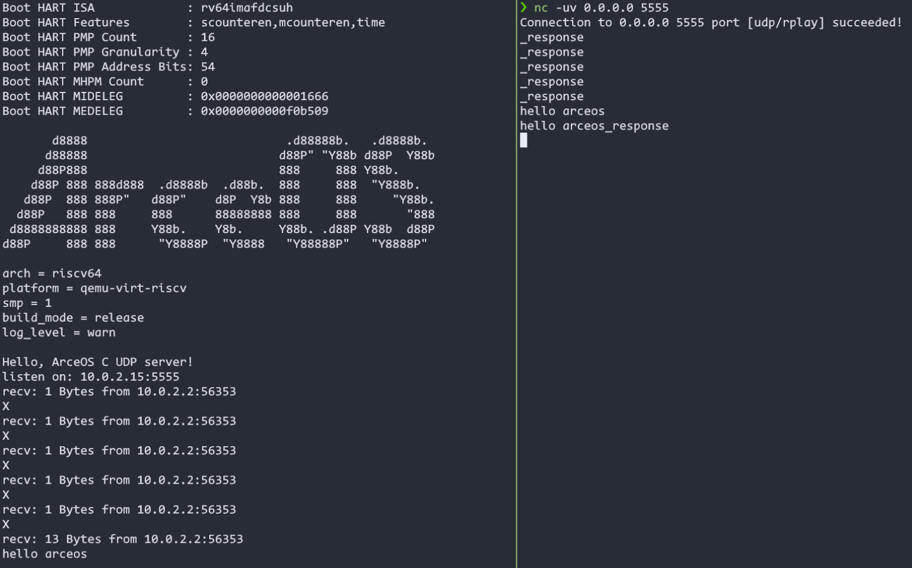
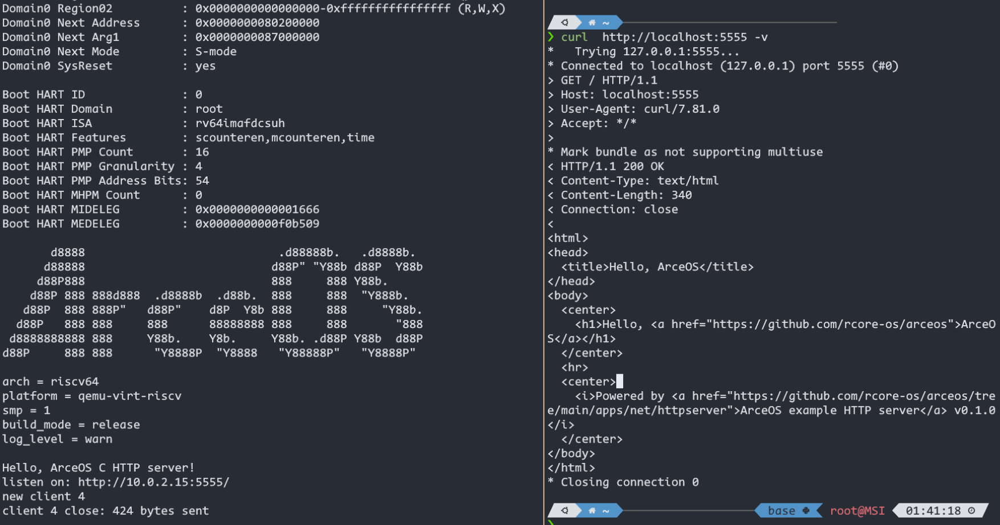

# 第十二周进度报告

吴大帅
## 本周工作
- 按照linux标准完善net的c接口(包括rust部分和c部分)
    - 已经全部完成: socket, connect, shutdown, recv, send, recvfrom, sendto, accept, listen, getaddrinfo
- 实现并完善c语言net app
    - udp server
    
    - http client (dns)
    
    - http server
    
- 重构cbinding的fs_table部分, 使其可以单独运行net和fs
- 简化错误处理
- 规范、完善代码，进行PR

## 下周计划
- 待定
