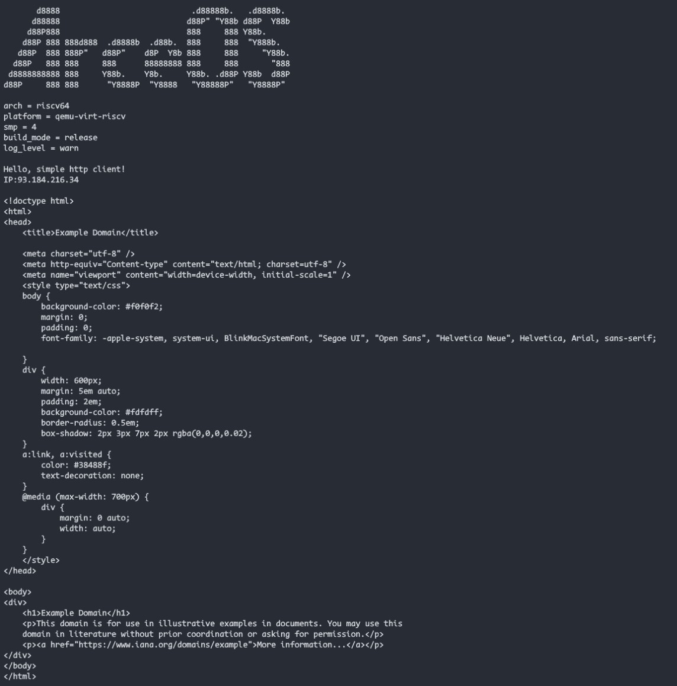
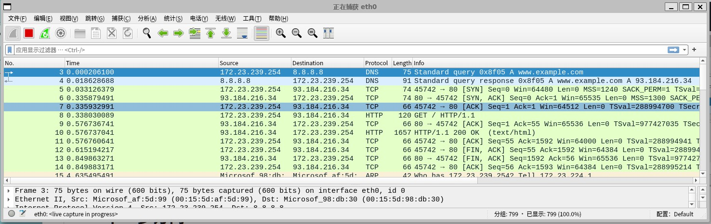

# 第八周进度报告

吴大帅

## 本周工作

- 在axnet中接入smoltcp的dns栈
- 阅读、参考std::net和libc部分源代码
- 在libax中调用dns相关接口, 实现dns查询的ToSocketAddrs Trait
- 增加包括dns功能的httpclient app
- 整理、完善代码，增加测例，通过ci，提出pr

## std::net支持完成情况

已经完成std::net基本功能api的支持

| Tcp                   | api                      | 已有实现 | col3 | UDP                           | api                                 | 新增实现 |
| --------------------- | ------------------------ | -------- | ---- | ----------------------------- | ----------------------------------- | -------- |
| std::net::TcpListener | bind                     | √       |      | std::net::UdpSocket           | bind                                | √       |
|                       | local_addr               | √       |      |                               | recv_from                           | √       |
|                       | try_clone                |          |      |                               | peek_from                           | √       |
|                       | accept                   | √       |      |                               | send_to                             | √       |
|                       | incoming                 |          |      |                               | peer_addr                           |          |
|                       | (set_)ttl                |          |      |                               | local_addr                          | √       |
|                       | take_error               |          |      |                               | try_clone                           |          |
|                       | set_nonblocking          |          |      |                               | (set_)write/read_timeout            |          |
|                       | fd等类型转化             |          |      |                               | broadcast/multicast_loop相关        |          |
| std::net::TcpStream   | connect                  | √       |      |                               | (set_)ttl                           |          |
|                       | connect_timeout          |          |      |                               | take_error                          |          |
|                       | peer_addr                | √       |      |                               | connect相关(connect,recv,send,peek) |          |
|                       | local_addr               | √       |      |                               | set_nonblocking                     |          |
|                       | shutdown                 | √       |      |                               | fd等类型转化                        |          |
|                       | try_clone                |          |      | Trait std::net::ToSocketAddrs | 各种类型转化为地址(包括域名查询)    | √       |
|                       | (set_)write/read_timeout |          |      |                               |                                     |          |
|                       | peek                     |          |      |                               |                                     |          |
|                       | (set_)nodelay            |          |      |                               |                                     |          |
|                       | (set_)ttl                |          |      |                               |                                     |          |
|                       | take_error               |          |      |                               |                                     |          |
|                       | set_nonblocking          |          |      |                               |                                     |          |
|                       | fd等类型转化             |          |      |                               |                                     |          |
|                       | Read/Write Trait        | √       |      |                               |                                     |          |

## demo

- httpclient: 可以根据域名或ip地址进行http请求， 实现了简单的http头解析，可以根据content-length解决tcp拆包问题。
  

  

## 下一步方向

为c应用提供类似libc的net接口

- 阅读了acreos里c应用支持的代码
